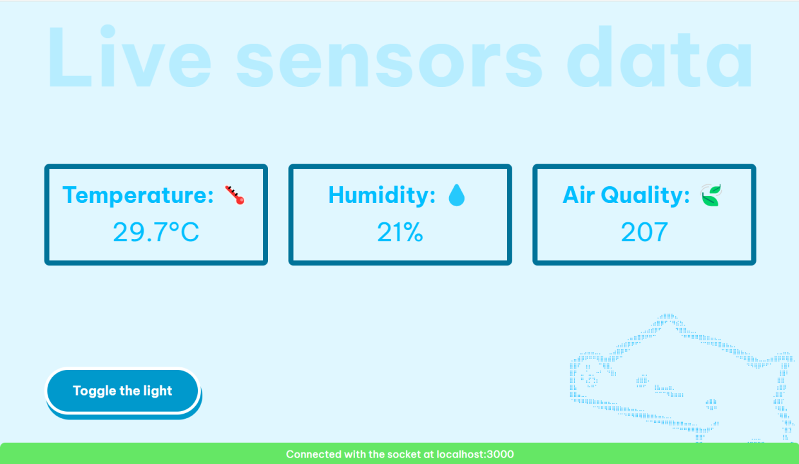

# 🚀 Getting Sensors Data Through Serial Port Communication

**Note:** This project is intended for educational and demonstration purposes. Depending on your requirements, alternative methods such as Wi-Fi or Bluetooth communication may offer more efficient solutions for similar use cases.

---

## ✨ Introduction
This project demonstrates how to retrieve sensor data — such as **temperature**, **humidity**, and **air quality** — from an Arduino Uno R3 using **serial port communication**, and visualize it in real-time on a **web interface** powered by **Socket.IO**.

---

## 🔥 Features
- 📡 Real-time streaming of sensor data from Arduino to the browser.
- 🎵 Fun **Bongo Cat** in web interface 
- 🛠️ A button to toggle the led light 

---

## 🖥️ Web Interface Preview



[(Arduino Circuit)](https://github.com/Manik2375/serial-sensor-stream/tree/main/sketch_airQualityMonitor)
 
---

## 🛠️ Technologies Used
- **Node.js** – Server-side application.
- **Socket.IO** – Real-time WebSocket communication between server and client.
- **SerialPort (npm package)** – Handles communication with Arduino over USB.
- **HTML / CSS / JavaScript** – Frontend for displaying sensor data and animations.

---

## ⚙️ Setup Instructions

1. **Clone this repository**:
   ```bash
   git clone https://github.com/Manik2375/serial-sensor-stream
   ```

2. **Navigate into the project folder:**
    ```bash 
    cd serial-sensor-stream
    ```

3. **Install required Node.js dependencies:**
    ```bash
    npm install
    ```
4. Ensure **baud rates** match between the Arduino sketch and the Node.js code. (e.g., 9600 baud)

5. Start server by running 
    ```bash
    npm run start
    ```


## 🎯 Usage
Use this project to easily visualize sensor readings from your Arduino on any device connected to your local network, complete with real-time updates and a web experience.

## 📂 Project Structure

```plaintext
serial-sensor-stream/
├── web/               
│   ├── index.html
│   └── style.css
├── sketch_airQualityMonitor/ 
│   └── sketch_airQualityMonitor.ino
├── server.js                
├── package.json             
└── README.md                
```
**Folders:**

- **web**  contains the HTML/CSS/JS for web interface

- **sketch_airQualityMonitor** contains the Arduino code for sensor data acquisition

(By the way, there's also [Web Serial API](https://developer.mozilla.org/en-US/docs/Web/API/Web_Serial_API) which you can use to directly read from serial ports, without using node.js but watchout for its support!)
